<div align="center">


<br/>

# 🚗 Smart Parking System

### Production-oriented REST API for intelligent parking management

**Automatic Slot Allocation** · **JWT Security** · **RBAC** · **Dynamic Pricing** · **Concurrency Control** · **Analytics**

<br/>

[](https://www.java.com/)
[](https://spring.io/projects/spring-boot)
[](https://spring.io/projects/spring-security)
[](https://www.mysql.com/)
[](https://maven.apache.org/)


<br/>

[**Overview**](#-overview) ·
[**Features**](#-feature-highlights) ·
[**Architecture**](#-architecture) ·
[**Core Flows**](#-core-flows) ·
[**API**](#-api-reference) ·
[**Run Locally**](#-run-locally)

</div>

---

## 📑 Table of Contents

- [Overview](#-overview)
- [Feature Highlights](#-feature-highlights)
- [Architecture](#-architecture)
- [Core Flows](#-core-flows)
- [Pricing Engine](#-pricing-engine)
- [Concurrency Control](#-concurrency-control)
- [Admin Analytics](#-admin-analytics)
- [Database Model](#-database-model)
- [API Reference](#-api-reference)
- [Project Structure](#-project-structure)
- [Tech Stack](#-tech-stack)
- [Run Locally](#-run-locally)
- [Roadmap](#-roadmap)
- [Author](#-author)

---

## 🎯 Overview

**Smart Parking System is not just a CRUD application.** It is a backend-focused system built around real-world engineering problems:

| | Question | Solution |
|---|---|---|
| 🔐 | How should authenticated users access protected APIs? | Stateless JWT + Spring Security + RBAC |
| 🅿️ | How can a parking slot be allocated automatically? | Vehicle-type based slot matching |
| ⚡ | What if multiple users request the last slot at once? | `@Transactional` + `PESSIMISTIC_WRITE` locking |
| 💰 | How can prices change with occupancy? | Database-backed rates + surge multiplier |
| 🔄 | How do entry and exit affect slot state? | Synchronized booking and slot state machines |
| 📊 | How do admins monitor utilization and revenue? | Dedicated analytics services and APIs |
| 🧩 | How do we keep API contracts separate from DB entities? | DTOs + MapStruct |

> [!NOTE]
> This repository contains the **backend only**. The frontend is maintained separately.

---

## ✨ Feature Highlights

| Area | What is implemented |
|---|---|
| 🔐 **Security** | JWT authentication, BCrypt hashing, role-based access control |
| 👤 **Users** | Registration, login, `USER` and `ADMIN` roles |
| 🚘 **Vehicles** | Registration with ownership validation |
| 🅿️ **Parking** | Automatic vehicle-type based slot allocation |
| 📋 **Booking** | Entry, exit and history |
| 💰 **Pricing** | Database-backed rates with occupancy-based surge pricing |
| ⚡ **Concurrency** | `@Transactional` with `PESSIMISTIC_WRITE` locking |
| 📊 **Analytics** | Occupancy, booking and revenue analytics |
| 📄 **History** | Pagination and sorting |
| 🧩 **API Design** | DTOs with MapStruct |
| 🛡️ **Errors** | Global exception handling and bean validation |

---

## 🏗️ Architecture

The project follows a clean layered architecture.

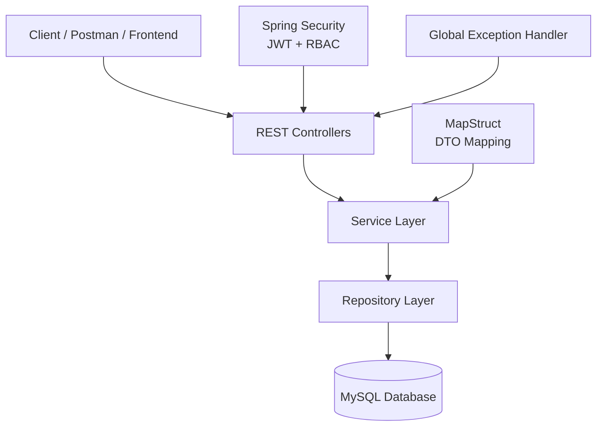

<details>
<summary><b>📥 Request processing pipeline</b></summary>

<br/>

```text
HTTP Request
   → Spring Security
   → JWT Validation
   → Authentication / Authorization
   → Controller
   → DTO Validation
   → Service (Business Rules)
   → Transaction
   → Repository
   → MySQL
   → Entity
   → MapStruct
   → Response DTO
   → HTTP Response
```

</details>

### 🧩 DTO & Mapping Strategy

Entities are never exposed directly through REST APIs.

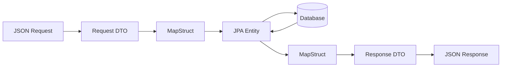

**Benefits:** cleaner API contracts · separation of API and persistence models · less manual mapping code · better maintainability.

### 🛡️ Validation & Exception Handling

Jakarta Bean Validation with centralized handling through `@RestControllerAdvice`.

| Validated | Handled scenarios |
|---|---|
| Required fields, email, password | Validation errors |
| Phone number, vehicle number | Resource not found, duplicate resources |
| Parking slot data, parking rates | Unauthorized actions, slot unavailable |
| | Authentication failures, access denied, runtime exceptions |

---

## 🔄 Core Flows

### 🔐 Authentication

Stateless JWT authentication with Spring Security.

**Capabilities:** registration and login · BCrypt hashing · JWT generation and validation · custom `UserDetailsService` · JWT authentication filter · `USER` / `ADMIN` roles · method-level security with `@PreAuthorize` · ownership validation.

```mermaid
flowchart LR
    A[Client] --> B[Login]
    B --> C[AuthenticationManager]
    C --> D[UserDetailsService]
    D --> E[Verify BCrypt Password]
    E --> F[Generate JWT]
    F --> G[Client Stores Token]
    G --> H[Authorization: Bearer Token]
    H --> I[JwtAuthenticationFilter]
    I --> J[Validate JWT]
    J --> K[SecurityContext]
    K --> L[Role-Based Authorization]
    L --> M[Controller]
```

### 🅿️ Intelligent Slot Allocation

Users **do not select a slot manually**. The backend finds an available slot that matches the vehicle type. Supported vehicles: 🚗 `CAR` · 🏍️ `BIKE` · 🛺 `AUTO`.

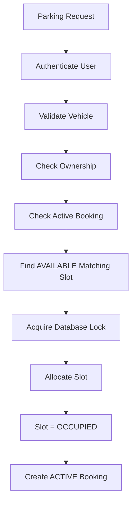

### 📋 Booking & Slot Lifecycle

Booking state and slot state are kept synchronized.

<table>
<tr>
<td width="50%" valign="top">

**Booking states**

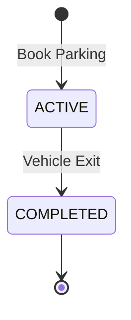

</td>
<td width="50%" valign="top">

**Slot states**

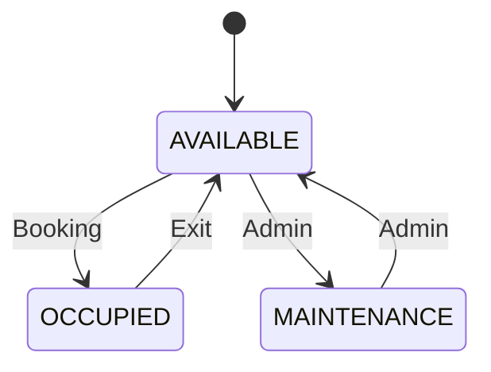

</td>
</tr>
</table>

### 🚪 Exit & Billing

1. Find the user's `ACTIVE` booking and verify ownership
2. Record exit time and calculate duration
3. Apply **minimum one-hour billing**
4. Apply the booking's **locked surge multiplier**
5. Calculate the final amount
6. Mark booking `COMPLETED` and release the slot

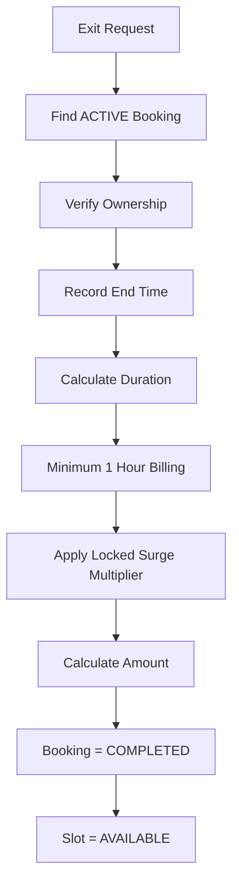

### 📄 Booking History

Users can retrieve their own bookings with **pagination, sorting and DTO-based responses**.

```http
GET /booking/my-bookings?page=0&size=10&sort=startTime,desc
GET /booking/my-bookings?page=0&size=5&sort=amount,desc
```

```json
{
  "content": [],
  "page": 0,
  "size": 10,
  "totalElements": 25,
  "totalPages": 3
}
```

---

## 💰 Pricing Engine

Rates are stored in the **database**, not hardcoded in booking logic, and can be managed independently through admin APIs.

| Vehicle | Rate |
|:---|---:|
| 🏍️ Bike | ₹20 / hour |
| 🛺 Auto | ₹30 / hour |
| 🚗 Car | ₹50 / hour |

### ⚡ Surge Pricing

A surge multiplier is calculated from current parking occupancy and **locked into the booking at entry**, so the pricing basis stays consistent until exit.

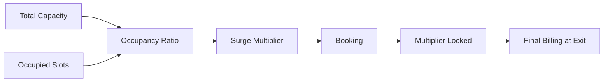

---

## ⚡ Concurrency Control

> **What happens if multiple users request the last available slot at almost the same time?**

Slot allocation is protected using `@Transactional`, `PESSIMISTIC_WRITE`, database-level locking and atomic slot state updates, so the same slot is never assigned to concurrent requests.

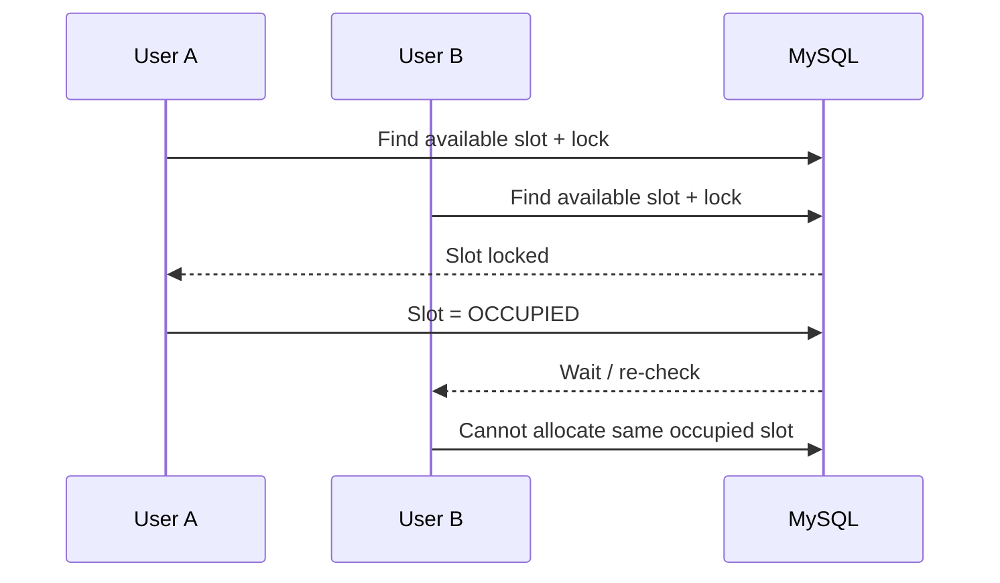

---

## 📊 Admin Analytics

| 🅿️ Parking analytics | 📋 Booking analytics |
|---|---|
| Total slots | Total bookings |
| Available slots | Active bookings |
| Occupied slots | Completed bookings |
| Maintenance slots | Total completed revenue |
| Overall occupancy % | |
| Vehicle-type-wise slot stats | |

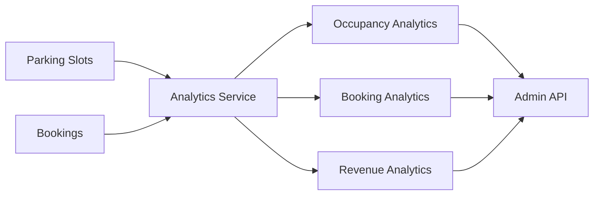

---

## 🗄️ Database Model

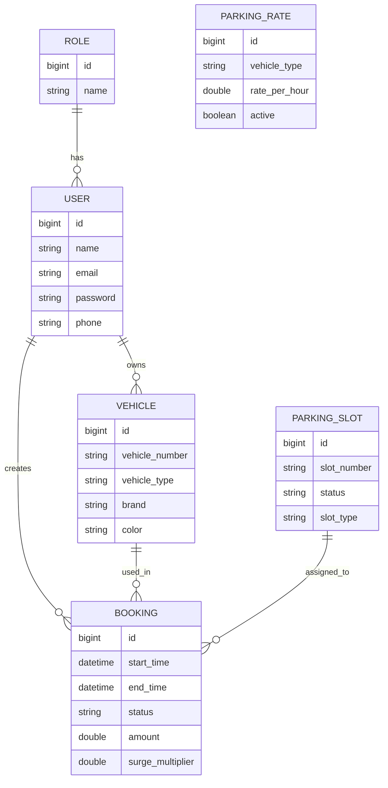

---

## 🌐 API Reference

Authenticated requests must send:

```http
Authorization: Bearer <JWT_TOKEN>
```

| Module | Method | Endpoint | Access |
|---|:---:|---|:---:|
| 🔐 Auth | `POST` | `/auth/register` | Public |
| 🔐 Auth | `POST` | `/auth/login` | Public |
| 🚘 Vehicle | `POST` | `/vehicle/saveVehicle` | 🔒 User |
| 🅿️ Slots | `POST` | `/parkingslot/register` | 🛡️ Admin |
| 📋 Booking | `POST` | `/booking/book` | 🔒 User |
| 📋 Booking | `PUT` | `/booking/exit` | 🔒 User |
| 📋 Booking | `GET` | `/booking/my-bookings` | 🔒 User |
| 💰 Rates | `GET` | `/parking-rates` | 🔒 Authenticated |
| 💰 Rates | `PUT` | `/parking-rates/{vehicleType}` | 🛡️ Admin |
| 📊 Analytics | `GET` | `/admin/parking/analytics` | 🛡️ Admin |
| 📊 Analytics | `GET` | `/admin/parking/booking-analytics` | 🛡️ Admin |

---

## 🗂️ Project Structure

<details>
<summary><b>Click to expand</b></summary>

```text
src/main/java/com/sahil/smart_parking_project
│
├── controller
│   ├── AuthController
│   ├── VehicleController
│   ├── ParkingSlotController
│   ├── ParkingBookingController
│   ├── ParkingRateController
│   ├── AdminAnalyticsController
│   └── AdminBookingAnalyticsController
│
├── service
│   ├── AuthService
│   ├── ParkingSlotBookingService
│   ├── ParkingSlotService
│   ├── VehicleService
│   ├── ParkingRateService
│   ├── ParkingAnalyticsService
│   └── ParkingBookingAnalyticsService
│
├── repository
│   ├── UserRepository
│   ├── VehicleRepository
│   ├── ParkingSlotRepository
│   ├── BookingRepository
│   ├── ParkingRateRepository
│   └── RoleRepository
│
├── entity
│   ├── User · Role · Vehicle
│   └── ParkingSlot · Booking · ParkingRate
│
├── dto
│   ├── Auth · Booking · Vehicle DTOs
│   ├── Parking Slot · Parking Rate DTOs
│   ├── Analytics DTOs
│   └── PageResponseDTO
│
├── security
│   ├── JwtUtils
│   ├── JwtAuthenticationFilter
│   ├── CustomUserDetailsService
│   └── SmartParkingSpringSecurity
│
├── map_struct
│   ├── UserMapper · VehicleMapper · BookingMapper
│   └── ParkingSlotMapper · ParkingRateMapper
│
├── globalException
│   ├── GlobalExceptionHandler · ErrorResponse
│   ├── ResourceNotFoundException · UnauthorizedActionException
│   └── SlotUnavailableException · DuplicateResourceException
│
├── enums
│   └── RoleType · VehicleType · SlotStatus · BookingStatus
│
└── util
    └── ParkingBookingSlotUtil
```

</details>

---

## 🛠️ Tech Stack

| Layer | Technologies |
|---|---|
| **Backend** | Java, Spring Boot, Spring Security, Spring Data JPA, Hibernate |
| **API & Auth** | REST, JWT, BCrypt, Jakarta Validation |
| **Mapping** | MapStruct |
| **Database** | MySQL |
| **Tooling** | Maven, Git & GitHub, Postman, Eclipse / Spring Tool Suite |

---

## ▶️ Run Locally

**1. Clone the repository**

```bash
git clone https://github.com/Sahil2u47/smart_parking_system.git
cd smart_parking_system
```

**2. Create the database**

```sql
CREATE DATABASE smart_parkingdb;
```

**3. Configure environment variables**

```env
DB_USERNAME=your_database_username
DB_PASSWORD=your_database_password
JWT_SECRET=your_long_secure_jwt_secret
```

**4. Run the application**

```bash
# Linux / macOS
./mvnw spring-boot:run

# Windows
mvnw.cmd spring-boot:run
```

The backend starts at **http://localhost:8182**

### 🔒 Security Model

- Stateless authentication via `SessionCreationPolicy.STATELESS`
- Public: `/auth/**`
- All other APIs require a valid JWT and, where applicable, the correct role

---

## 🔮 Roadmap

- [ ] 💳 Payment gateway integration
- [ ] 🔔 Email / SMS notifications

---

## 🎓 What This Project Demonstrates

Beyond basic CRUD, this backend covers **RESTful API design · layered architecture · Spring Security with JWT and RBAC · JPA/Hibernate relationships · transaction management · pessimistic locking · DTO design with MapStruct · bean validation · global exception handling · dynamic pricing · booking lifecycle management · pagination and sorting · business analytics**.

The focus is on understanding the real backend request flow: business rules, security, persistence, transactions and concurrency.

---

## 👨‍💻 Author

<div align="center">

### Sahid Anwar
**Java Backend Developer · Spring Boot Developer**

[](https://github.com/Sahil2u47)
[](https://linkedin.com/in/sahid-anwar-955898280/)

<br/>

*Built with ☕ Java + Spring Boot + persistence + security + a lot of debugging.*

**🚗 Smart Parking System — Find. Book. Park.**

⭐ If you find this project useful, consider starring the repository.

</div>
