<div align="center">


<br/><br/>

# 🚗 Smart Parking System

**A production-grade REST API that allocates, prices and manages parking — automatically.**

<sub>Slot allocation &nbsp;•&nbsp; JWT + RBAC &nbsp;•&nbsp; Surge pricing &nbsp;•&nbsp; Pessimistic locking &nbsp;•&nbsp; Admin analytics</sub>

<br/>

[](https://www.java.com/)
[](https://spring.io/projects/spring-boot)
[](https://spring.io/projects/spring-security)
[](https://www.mysql.com/)
[](https://maven.apache.org/)


<br/>

[**Overview**](#-overview) &nbsp;·&nbsp;
[**Features**](#-feature-highlights) &nbsp;·&nbsp;
[**Architecture**](#-architecture) &nbsp;·&nbsp;
[**Core Flows**](#-core-flows) &nbsp;·&nbsp;
[**API**](#-api-reference) &nbsp;·&nbsp;
[**Quick Start**](#-quick-start)

</div>

<br/>

---

<table align="center">
<tr>
<td align="center" width="25%"><h2>3</h2><sub>Vehicle types<br/>CAR · BIKE · AUTO</sub></td>
<td align="center" width="25%"><h2>2</h2><sub>Roles<br/>USER · ADMIN</sub></td>
<td align="center" width="25%"><h2>11</h2><sub>REST endpoints</sub></td>
<td align="center" width="25%"><h2>0</h2><sub>Double-booked slots<br/>by design</sub></td>
</tr>
</table>

---

## 📑 Table of Contents

<details>
<summary><b>Click to expand</b></summary>

<br/>

1. [Overview](#-overview)
2. [Feature Highlights](#-feature-highlights)
3. [Architecture](#-architecture)
4. [Core Flows](#-core-flows)
5. [Pricing Engine](#-pricing-engine)
6. [Concurrency Control](#-concurrency-control)
7. [Admin Analytics](#-admin-analytics)
8. [Database Model](#-database-model)
9. [API Reference](#-api-reference)
10. [Project Structure](#-project-structure)
11. [Tech Stack](#-tech-stack)
12. [Quick Start](#-quick-start)
13. [Roadmap](#-roadmap)
14. [Author](#-author)

</details>

---

## 🎯 Overview

> **Smart Parking System is not a CRUD demo.** It is a backend built around the problems real parking platforms actually face — security, fairness under concurrency, pricing and observability.

| | Real-world question | How this project answers it |
|:---:|---|---|
| 🔐 | How do we protect APIs without server sessions? | Stateless **JWT** + Spring Security + **RBAC** |
| 🅿️ | Who picks the slot? | The backend — **vehicle-type based** automatic allocation |
| ⚡ | What if two users grab the last slot at once? | `@Transactional` + **`PESSIMISTIC_WRITE`** locking |
| 💰 | How should price react to demand? | DB-backed rates + **occupancy-based surge** multiplier |
| 🔄 | How do entry and exit affect state? | Synchronized **booking & slot state machines** |
| 📊 | How do admins see utilization and revenue? | Dedicated **analytics services** and APIs |
| 🧩 | How do we keep API and DB models decoupled? | **DTOs + MapStruct** |

> [!NOTE]
> This repository contains the **backend only**. The frontend is maintained separately.

---

## ✨ Feature Highlights

<table>
<tr>
<td width="50%" valign="top">

### 🔐 Security
JWT authentication, BCrypt password hashing, method-level `@PreAuthorize`, role-based access and ownership validation.

### 🅿️ Smart Allocation
Users never choose a slot. The system finds and locks a matching `AVAILABLE` slot for the vehicle type.

### 📋 Booking Lifecycle
Entry, exit and paginated history, with booking and slot states always kept in sync.

### 💰 Dynamic Pricing
Rates live in the database. A surge multiplier is computed from occupancy and **locked at entry**.

</td>
<td width="50%" valign="top">

### ⚡ Concurrency Safe
Database-level pessimistic locking guarantees a slot is never assigned twice.

### 📊 Admin Analytics
Occupancy, booking and revenue insights, including vehicle-type-wise slot stats.

### 🧩 Clean API Design
Entities are never exposed. Request/response DTOs are mapped with MapStruct.

### 🛡️ Robust Errors
Jakarta Bean Validation and a centralized `@RestControllerAdvice` with consistent error responses.

</td>
</tr>
</table>

---

## 🏗️ Architecture

A clean, layered architecture with clear responsibilities per layer.

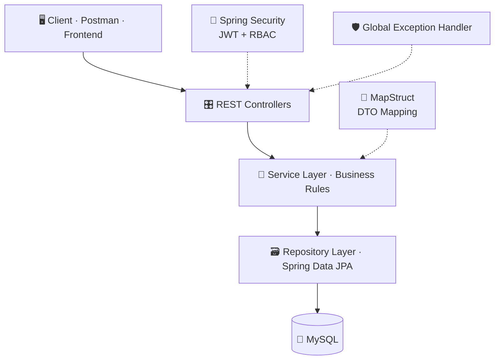

<details>
<summary><b>📥 Request processing pipeline</b></summary>

<br/>

```text
HTTP Request
   → Spring Security
   → JWT Validation
   → Authentication / Authorization
   → Controller
   → DTO Validation
   → Service (Business Rules)
   → Transaction
   → Repository
   → MySQL
   → Entity
   → MapStruct
   → Response DTO
   → HTTP Response
```

</details>

### 🧩 DTO & Mapping Strategy

Entities are **never** exposed through REST APIs.

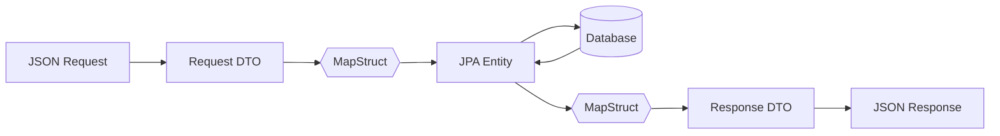

| Benefit | Why it matters |
|---|---|
| Clean API contracts | Clients depend on DTOs, not on table structure |
| Decoupled models | DB schema can evolve without breaking the API |
| Less boilerplate | MapStruct generates mappers at compile time |
| Maintainability | One place to change a mapping |

### 🛡️ Validation & Exception Handling

Jakarta Bean Validation with centralized handling through `@RestControllerAdvice`.

| ✅ Validated | 🚨 Handled scenarios |
|---|---|
| Required fields, email, password | Validation errors |
| Phone number, vehicle number | Resource not found · duplicate resources |
| Parking slot data, parking rates | Unauthorized actions · slot unavailable |
| | Authentication failures · access denied · runtime exceptions |

---

## 🔄 Core Flows

### 🔐 Authentication

Stateless JWT authentication with Spring Security.

> **Capabilities:** registration & login · BCrypt hashing · JWT generation & validation · custom `UserDetailsService` · JWT authentication filter · `USER` / `ADMIN` roles · method-level security with `@PreAuthorize` · ownership validation

**Phase 1 — Login (token generation)**

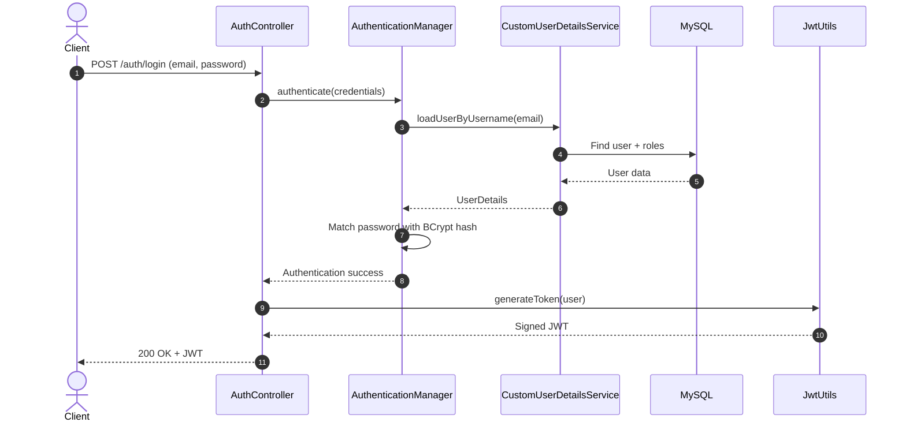

**Phase 2 — Accessing a protected API**

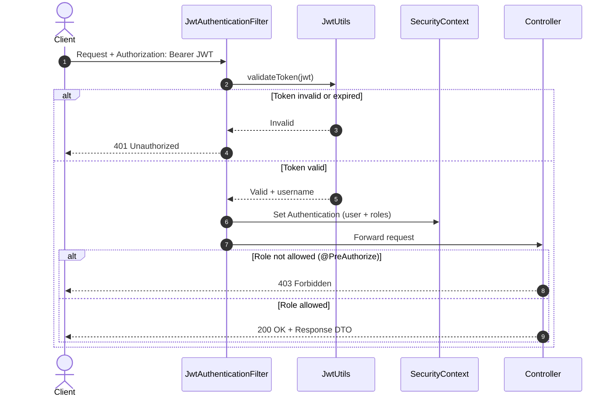

### 🅿️ Intelligent Slot Allocation

Users **do not select a slot manually**. The backend finds an available slot that matches the vehicle type.

| Vehicle | Enum |
|:---:|:---:|
| 🚗 Car | `CAR` |
| 🏍️ Bike | `BIKE` |
| 🛺 Auto | `AUTO` |

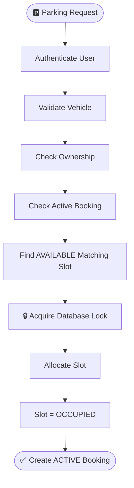

### 📋 Booking & Slot Lifecycle

Booking state and slot state are always kept synchronized.

<table>
<tr>
<td width="50%" valign="top">

**Booking states**

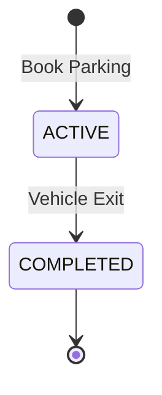

</td>
<td width="50%" valign="top">

**Slot states**

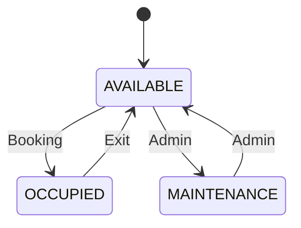

</td>
</tr>
</table>

### 🚪 Exit & Billing

| Step | Action |
|:---:|---|
| 1 | Find the user's `ACTIVE` booking and verify ownership |
| 2 | Record exit time and calculate duration |
| 3 | Apply **minimum one-hour billing** |
| 4 | Apply the booking's **locked surge multiplier** |
| 5 | Calculate the final amount |
| 6 | Mark booking `COMPLETED` and release the slot |

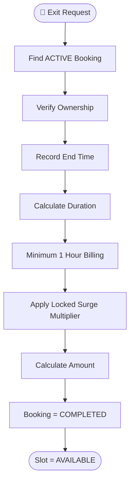

### 📄 Booking History

Users can retrieve their own bookings with **pagination, sorting and DTO-based responses**.

```http
GET /booking/my-bookings?page=0&size=10&sort=startTime,desc
GET /booking/my-bookings?page=0&size=5&sort=amount,desc
```

```json
{
  "content": [],
  "page": 0,
  "size": 10,
  "totalElements": 25,
  "totalPages": 3
}
```

---

## 💰 Pricing Engine

Rates are stored in the **database**, not hardcoded in booking logic, and are managed independently through admin APIs.

| Vehicle | Base rate |
|:---|---:|
| 🏍️ Bike | **₹20** / hour |
| 🛺 Auto | **₹30** / hour |
| 🚗 Car | **₹50** / hour |

### ⚡ Surge Pricing

A surge multiplier is calculated from current parking occupancy and **locked into the booking at entry**, so the pricing basis stays consistent until exit.

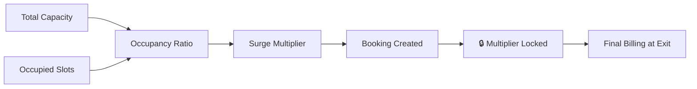

> [!TIP]
> Locking the multiplier at entry means a driver is never charged more because the lot filled up *after* they arrived.

---

## ⚡ Concurrency Control

> **What happens if multiple users request the last available slot at almost the same time?**

Slot allocation is protected with `@Transactional`, `PESSIMISTIC_WRITE`, database-level locking and atomic slot state updates — the same slot is never assigned to concurrent requests.

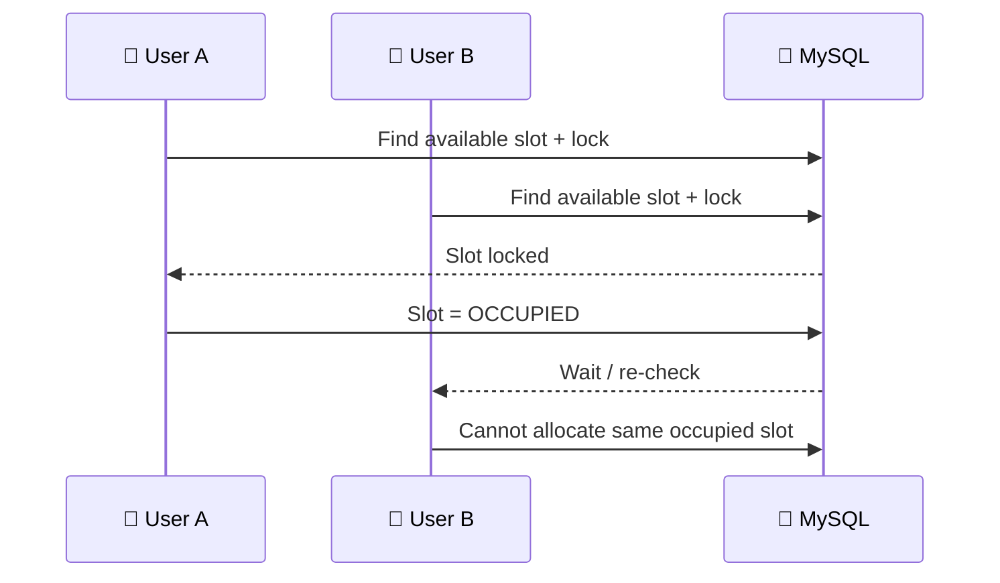

| Mechanism | Purpose |
|---|---|
| `@Transactional` | Keeps the allocation atomic |
| `PESSIMISTIC_WRITE` | Blocks competing requests on the same row |
| Atomic state update | Slot and booking change together or not at all |

---

## 📊 Admin Analytics

<table>
<tr>
<td width="50%" valign="top">

### 🅿️ Parking analytics
- Total slots
- Available slots
- Occupied slots
- Maintenance slots
- Overall occupancy %
- Vehicle-type-wise slot stats

</td>
<td width="50%" valign="top">

### 📋 Booking analytics
- Total bookings
- Active bookings
- Completed bookings
- Total completed revenue

</td>
</tr>
</table>

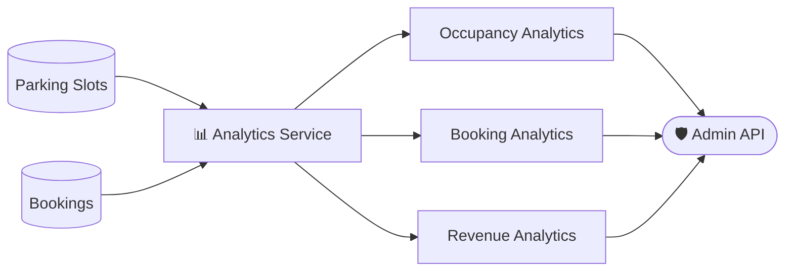

---

## 🗄️ Database Model

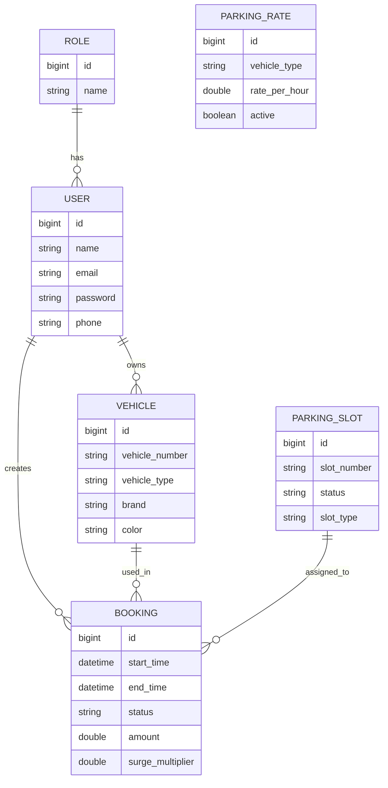

---

## 🌐 API Reference

All protected endpoints require:

```http
Authorization: Bearer <JWT_TOKEN>
```

| Module | Method | Endpoint | Access |
|---|:---:|---|:---:|
| 🔐 Auth |  | `/auth/register` | 🌍 Public |
| 🔐 Auth |  | `/auth/login` | 🌍 Public |
| 🚘 Vehicle |  | `/vehicle/saveVehicle` | 🔒 User |
| 🅿️ Slots |  | `/parkingslot/register` | 🛡️ Admin |
| 📋 Booking |  | `/booking/book` | 🔒 User |
| 📋 Booking |  | `/booking/exit` | 🔒 User |
| 📋 Booking |  | `/booking/my-bookings` | 🔒 User |
| 💰 Rates |  | `/parking-rates` | 🔑 Authenticated |
| 💰 Rates |  | `/parking-rates/{vehicleType}` | 🛡️ Admin |
| 📊 Analytics |  | `/admin/parking/analytics` | 🛡️ Admin |
| 📊 Analytics |  | `/admin/parking/booking-analytics` | 🛡️ Admin |

<sub>🌍 Public &nbsp;·&nbsp; 🔑 Any authenticated user &nbsp;·&nbsp; 🔒 Role `USER` &nbsp;·&nbsp; 🛡️ Role `ADMIN`</sub>

---

## 🗂️ Project Structure

<details>
<summary><b>Click to expand</b></summary>

```text
src/main/java/com/sahil/smart_parking_project
│
├── controller
│   ├── AuthController
│   ├── VehicleController
│   ├── ParkingSlotController
│   ├── ParkingBookingController
│   ├── ParkingRateController
│   ├── AdminAnalyticsController
│   └── AdminBookingAnalyticsController
│
├── service
│   ├── AuthService
│   ├── ParkingSlotBookingService
│   ├── ParkingSlotService
│   ├── VehicleService
│   ├── ParkingRateService
│   ├── ParkingAnalyticsService
│   └── ParkingBookingAnalyticsService
│
├── repository
│   ├── UserRepository
│   ├── VehicleRepository
│   ├── ParkingSlotRepository
│   ├── BookingRepository
│   ├── ParkingRateRepository
│   └── RoleRepository
│
├── entity
│   ├── User · Role · Vehicle
│   └── ParkingSlot · Booking · ParkingRate
│
├── dto
│   ├── Auth · Booking · Vehicle DTOs
│   ├── Parking Slot · Parking Rate DTOs
│   ├── Analytics DTOs
│   └── PageResponseDTO
│
├── security
│   ├── JwtUtils
│   ├── JwtAuthenticationFilter
│   ├── CustomUserDetailsService
│   └── SmartParkingSpringSecurity
│
├── map_struct
│   ├── UserMapper · VehicleMapper · BookingMapper
│   └── ParkingSlotMapper · ParkingRateMapper
│
├── globalException
│   ├── GlobalExceptionHandler · ErrorResponse
│   ├── ResourceNotFoundException · UnauthorizedActionException
│   └── SlotUnavailableException · DuplicateResourceException
│
├── enums
│   └── RoleType · VehicleType · SlotStatus · BookingStatus
│
└── util
    └── ParkingBookingSlotUtil
```

</details>

---

## 🛠️ Tech Stack

| Layer | Technologies |
|---|---|
| ⚙️ **Backend** | Java · Spring Boot · Spring Security · Spring Data JPA · Hibernate |
| 🔌 **API & Auth** | REST · JWT · BCrypt · Jakarta Validation |
| 🧩 **Mapping** | MapStruct |
| 🗄️ **Database** | MySQL |
| 🧰 **Tooling** | Maven · Git & GitHub · Postman · Eclipse / Spring Tool Suite |

---

## 🚀 Quick Start

### ✅ Prerequisites

| Requirement | Version |
|---|---|
| ☕ Java | 21+ |
| 🐬 MySQL | 8.x |
| 📦 Maven | Wrapper included (`mvnw`) |

### 1️⃣ Clone the repository

```bash
git clone https://github.com/Sahil2u47/smart_parking_system.git
cd smart_parking_system
```

### 2️⃣ Create the database

```sql
CREATE DATABASE smart_parkingdb;
```

### 3️⃣ Configure environment variables

```env
DB_USERNAME=your_database_username
DB_PASSWORD=your_database_password
JWT_SECRET=your_long_secure_jwt_secret
```

> [!WARNING]
> Never commit real credentials or your `JWT_SECRET`. Use a long, random secret in every environment.

### 4️⃣ Run the application

```bash
# Linux / macOS
./mvnw spring-boot:run

# Windows
mvnw.cmd spring-boot:run
```

🎉 The backend is now live at **http://localhost:8182**

### 🔒 Security Model

| Rule | Detail |
|---|---|
| Session policy | Stateless via `SessionCreationPolicy.STATELESS` |
| Public routes | `/auth/**` |
| Everything else | Requires a valid JWT and, where applicable, the correct role |

---

## 🔮 Roadmap

- [ ] 💳 Payment gateway integration
- [ ] 🔔 Email / SMS notifications

---

## 🎓 What This Project Demonstrates

Beyond basic CRUD, this backend covers:

`RESTful API design` · `Layered architecture` · `Spring Security with JWT & RBAC` · `JPA/Hibernate relationships` · `Transaction management` · `Pessimistic locking` · `DTO design with MapStruct` · `Bean validation` · `Global exception handling` · `Dynamic pricing` · `Booking lifecycle management` · `Pagination & sorting` · `Business analytics`

The focus is on understanding the **real backend request flow**: business rules, security, persistence, transactions and concurrency.

---

## 👨‍💻 Author

<div align="center">

### Sahid Anwar
**Java Backend Developer · Spring Boot Developer**

[](https://github.com/Sahil2u47)
[](https://linkedin.com/in/sahid-anwar-955898280/)

<br/>

*Built with ☕ Java + Spring Boot + persistence + security + a lot of debugging.*

### 🚗 Smart Parking System — **Find. Book. Park.**

⭐ If you find this project useful, consider starring the repository.

</div>
